### 🚨 I am no longer maintaining this mod. 🚨
#### As of Feb 12th 2025, this mod still works on game version v1.3.1 ?12035. 

*This mod will be de-listed once a future game update breaks the mod from functioning. If you are interested in maintaining this mod, reach out on Discord.*

# [Myth] Music

Translations for all languages supported by melvor idle have been provided with this mod, however, I only speak English and cannot guarantee the accuracy of translations.

All translations were generated using chat gpt.

**If you see an incorrect or missing translation, please create an issue on github providing the correct translation. Thank you!**

https://github.com/mythridium/music

Does not contain actual music. Sorry. :(

Disclaimer: **Please backup your save file before installing this mod.**

This mod should be safe to install and uninstall at any time, however the game is designed to automatically delete data for mods that aren't loaded. **So if you uninstall this mod and load your save game, the Music data will be deleted by the game.** If you re-install the mod after the data is deleted, the skill will be reset to level 1, including masteries. If you uninstall and re-install without ever loading your save game, the data should be safe and retained.

Please provide any feedback or bug reports, would love to hear your thoughts.

## Design Methodology

When designing this skill, my aims were to take pressure off early game gold, while also providing a late game gold siphon. This makes it an attractive early game skill for adventure mode, and late game, especially once Township is up and running, the buffs are designed to be powerful enough that spending the gold is deemed worth it. By limiting to only a couple of bards, the player will need to spend their masses of gold to get the bonuses for the skills they are training.

## Change Log
Can be found here: https://github.com/mythridium/music/blob/main/CHANGE_LOG.md

## Training

Music is a brand new skill which combines themes from Astrology, Thieving and Agility. It provides an easy way to obtain gold and powerful bonuses that benefit other skills.

Earn tips (GP) while you train bards with various instruments, then hire the bards you have trained to provide you with powerful bonuses while you train other skills.

This mod includes a new mastery token for the skill and both skill cape and superior skill cape.

## Mastery Unlocks

To unlock additional modifiers, once the respective mastery level has been attained, you can choose to unlock a modifier mastery.

Modifiers can be unlocked in any order once the mastery level has been attained, but once a mastery modifier has been unlocked the cost to hire the bard is increased.

The cost to unlock a modifier is as follows

* Level 40 Mastery Unlock - 100,000 GP + 1 Essence of Music
* Level 75 Mastery Unlock - 1,000,000 GP + 1 Essence of Music
* Level 99 Mastery Unlock - 10,000,000 GP + 1 Essence of Music

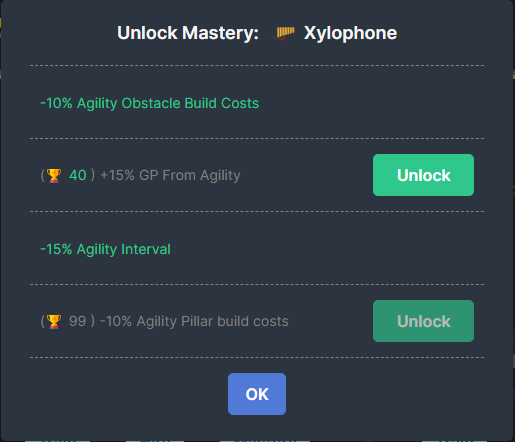

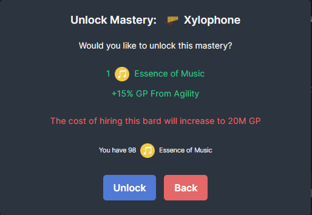

## Hiring a Bard

You can hire various bards to play on your behalf. These bards provide powerful bonuses to help you while you train other skills, however the more skilled a bard is, the more expensive it will become to hire them.

You can only hire a single bard at a time (two if you purchase the Band Practice upgrade).

The cost to hire a bard increases with the number of modifiers unlocked.

The cost for hiring a bard is as follows (assuming no hire cost reduction)

* 1st Mastery Unlocked - 10,000 GP
* 2nd Mastery Unlocked - 100,000 GP
* 3rd Mastery Unlocked - 1,000,000 GP
* 4th Mastery Unlocked - 10,000,000 GP

### Drops

While training you have a chance to obtain Signet Ring Half A, Circlet of Rhaelyx and Mysterious Stones, just like any other non combat skill.

Tips (GP) earned while training do scale with global gold increases.

### Sheet Music, Essence of Music, Gems and Utilities

Training Music has a 2% chance to drop sheet music, these are used for hired bard instrument upgrades.

Sheet Music drop chance is a flat 2% and is not modified by any rarity increases, the only other boost to sheet music drop chance is applying Diamond String to your hired bards instrument. With two bards, this means you can get a total of 12% drop chance for Sheet Music.

## Hired Bard Instrument

Hired bard instruments can be enhanced in various ways. They can be upgraded, socketed with a gem and applied with an utility.

Upgrades are destroyed if you hire a new bard. Re-hiring a previously hired bard will require upgrading, socketing and applying the instrument again.

### Upgrade

Upgrading a hired bards instrument unlocks a 5th modifier, to do so, you require an Essence of Music.

Essence of Music
Upgrade from Sheet Music
1,000,000GP + 50 Sheet Music
Unlocks a 5th modifier on hired bard instrument when upgraded.

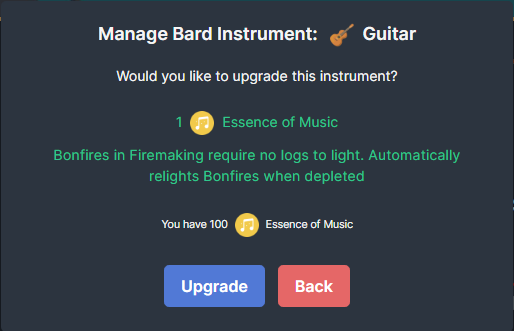

### Gem Socket

You can select one of three gems to socket into your bards instrument. Only one can be active at a time, and you may freely switch provided you have the resources.

Polished Topaz Gem
Upgrade from Topaz
50,000 GP + 50 Topaz + 10 Sheet Music
+5% Music GP

Polished Ruby Gem
Upgrade from Ruby
50,000 GP + 50 Ruby + 10 Sheet Music
+5% Music Skill XP

Polished Sapphire Gem
Upgrade from Sapphire
50,000 GP + 50 Sapphire + 10 Sheet Music
+5% Music Mastery XP

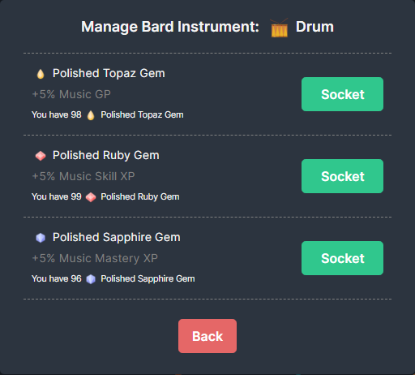

### Utility

You can select one of three utilities to apply onto your bards instrument. Only one can be active at a time, and you may freely switch provided you have the resources.

Diamond String
Upgrade from Bowstring
50,000 GP + 100 Diamond + 100 Bowstring + 50 Music Sheet
+5% Sheet Music drop chance

Pristine Leather
Upgrade from Leather
50,000 GP + 100 Diamond + 100 Leather + 50 Music Sheet
-5% Music Interval

Mystic Oil
Upgrade from Weird Gloop
50,000 GP + 100 Diamond + 100 Weird Gloop + 50 Music Sheet
+1 additional reward roll while training Music

Mystic Oil will roll for rewards an additional time when training the music skill.

This means if you have Mystic Oil applied, every time you train an instrument, the rewards are rolled an additional time.

This includes:
* pets
* rare drops
* summoning marks
* mastery tokens

For example, if you have Band Practice with two bards hired, both equipped with Mystic Oil.

1 tick of training Music will roll 3 times for a chance to get the pet, rare drops, summoning marks and mastery tokens.

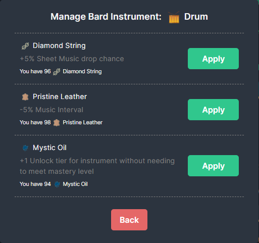

## Band Practice

The shop sells an upgrade which unlocks a second bard slot. This upgrade requires Level 110 Music and costs 1B GP.

## Concert Pass

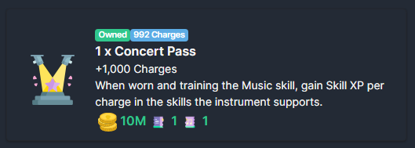

The shop sells item charges for a Concert Pass.
* Purchase Cost: Concert Pass Half (A) + Concert Pass Half (B) + 10M GP
* When equipped in the offhand and has charges, the concert pass will provide skill xp for the skills the instrument supports.
* Drop rate for Concert Pass Halves is 0.00075% or roughly equivalent to the Ancient Ring of Skill and Ancient Ring of Mastery drop chance from Fishing with a special chance of 5%.

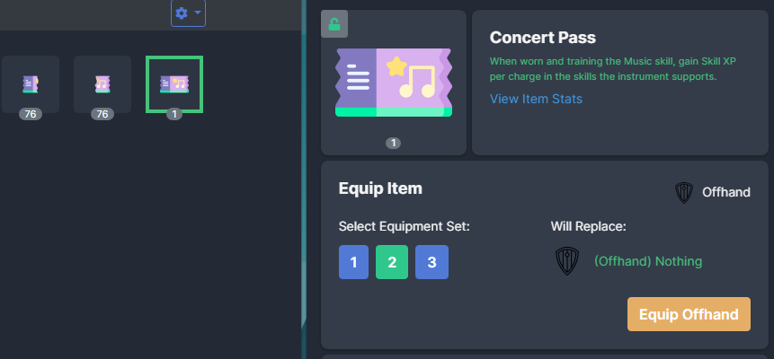

For example, the Guitar supports Woodcutting and Firemaking, while training the Guitar with the Concert Pass equipped and charges available. Woodcutting and Firemaking will also gain Skill XP.

**The skill must be unlocked to gain skill xp in Adventure mode.**

The amount of Skill XP should be roughly 1 level worth for every 1,000 charges. This is done by finding the xp difference between the current level and the next level, then dividing the amount by 1,000.

For example:
* level 55 requires 166,636 total experience and level 56 requires 184,040 total experience.
* 184,040 - 166,636 = 15,764 experience to level up from 55 to 56
* 15,764 / 1,000 = 15 experience per charge used

When you level up, it will shift the calculation to the next level.

The level calculation is clamped to a max skill level of 120, which roughly equates to ~10,000 xp per charge used at max level, and the minimum xp gained is clamped to 1, so the early levels will progress faster then 1 level per 1,000 charges since they would grant less then 1 xp without the clamp.

## Skill Unlocks

Leveling the Music skill unlocks additional musical instruments to train your bards with.

## Mastery Pool Unlocks

Mastery Pool checkpoints provide additional xp, mastery xp, music interval and hire cost reduction.

## Mastery Unlocks

As you level up an instruments mastery, the tips you earn increases. You can also unlock additional bonuses and reduce the hire cost.

## Skill Capes

The Music Skill Cape

The Superior Music Skill Cape

## Pet

The Music skill also contains a pet: Muse which provides -0.15s Music Interval

## Herblore

The Generous Gratuity Potion can be brewed using the Herblore skill.

* Herblore Unlock Level: 80
* Materials: 1 Pigtayle Herb + 1,000 GP
* Tier 1: +10% Music GP, 15 Charges
* Tier 2: +20% Music GP, 25 Charges
* Tier 3: +30% Music GP, 35 Charges
* Tier 4: +50% Music GP, 50 Charges

The potion has also been added to Potion Box II from Township, at the same rarity as the Herblore Potion.

## Summoning

The Music skill has its own tablet. The Bard! The Bard is both a combat and skill tablet.

* Tier: 3
* Summoning Level Requirement: 90
* Summoning Max Hit: 192
* Skill Bonus: +5% Music GP

In addition, the Bard has synergies with every single other tablet. Since Music is a skill that focuses on boosting other skills, its synergy helps all other skills. It basically doubles the tablet effect of the tablet it is synergizing with (by granting the same tablet modifiers via the synergy).

Example: Devil gives -5% Firemaking Interval, if synergized with the Bard, the synergy will provide an addition -5% Firemaking Interval for a total of -10% Firemaking Interval being provided from the tablets.

The Fox synergy actually works in reverse, kind of... the Bard synergy doubles the Fox tablet modifier, which then boosts the Bards Summoning max hit.

## Agility

Agility has been modified so that the Obstacle 10 - Waterfall now also benefits the Music skill.

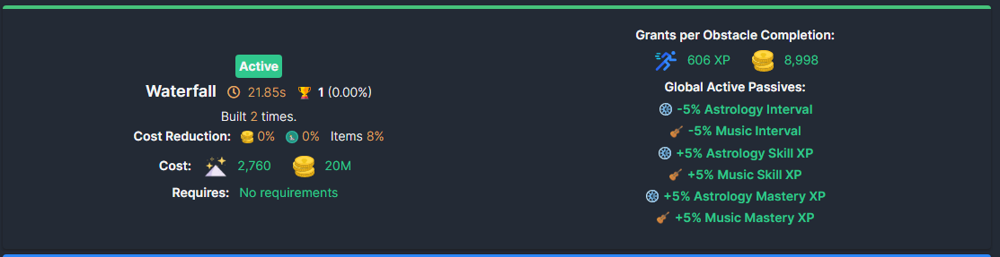

## Astrology

Astrology has been modified so that the Variel constellation now also benefits the Music skill.

## Township

The Music skill adds a Music Scroll of XP granting +3% Music Skill XP. It functions the same as other scrolls of xp.

It requires level 15 Township and level 15 Music to purchase, with a default value of 80 planks per scroll.

The Music skill adds a Music Outfit, which is fully integrated just like all the other skilling outfits.

## The Circus

The jesters have emerged from The Circus. The jesters are notorious pranksters. They have been rivals with the bards since the beginning of time, known for stealing instruments, many tussles have broken out between the bards and the jesters.

The Circus is a new combat area that contains 3 types of jesters to fight.

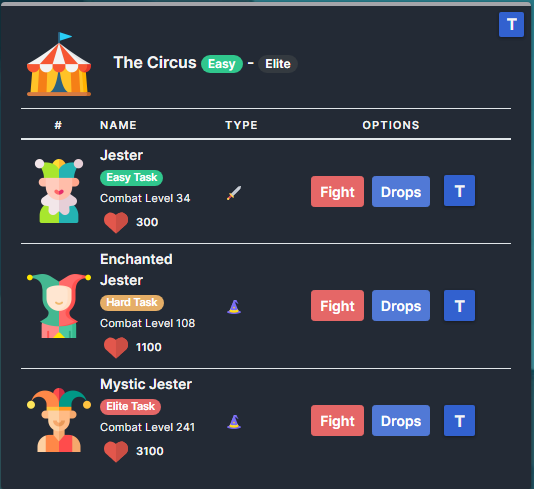

### Jester

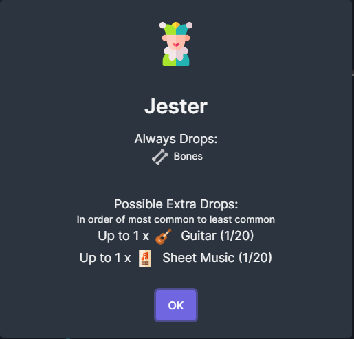

### Enchanted Jester

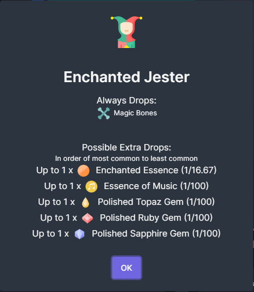

### Mystic Jester

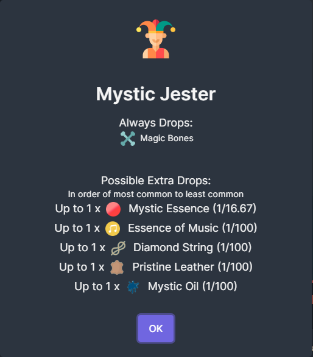

### Guitar Weapon

The Jester can drop a Guitar which is a new 2H Weapon which requires attack and music levels to equip. The Guitar can be upgraded twice.

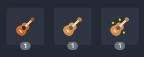

### Guitar

Drops from the Jester

### Enchanted Guitar

Upgrade Cost: 100K GP + 50 Enchanted Essence + 1 Guitar

Enchanted Essence is dropped from the Enchanted Jester

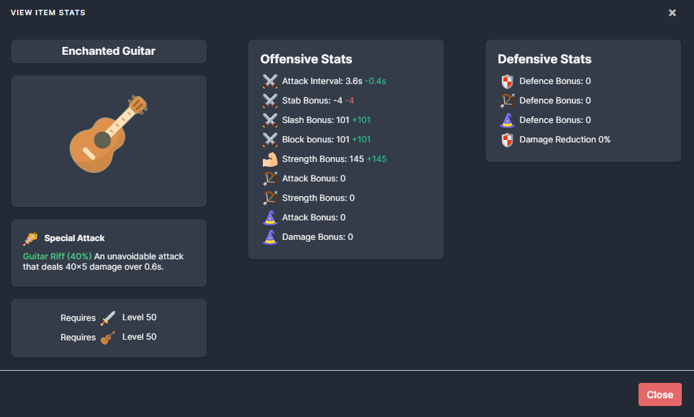

### Mystic Guitar

Upgrade Cost: 1M GP + 50 Mystic Essence + 1 Enchanted Guitar

Mystic Essence is dropped from the Mystic Jester

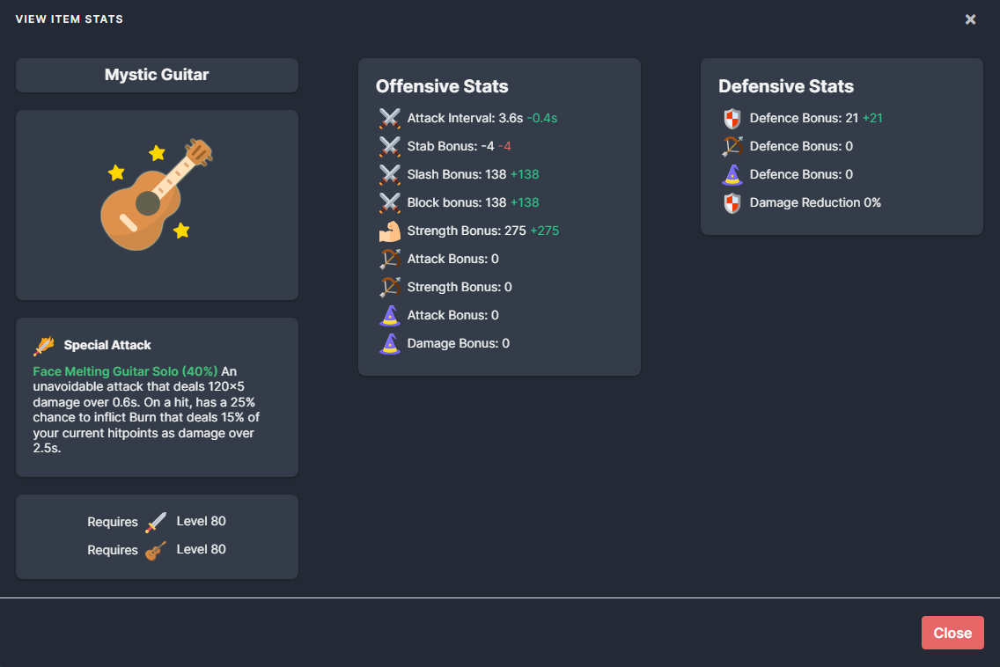

## Ancient Relics Gamemode

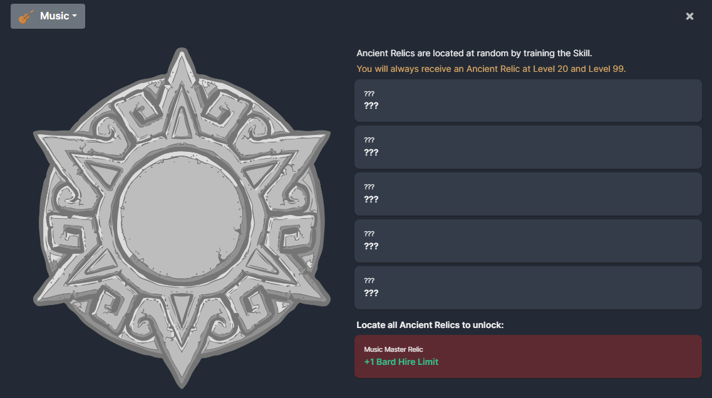

Music has Ancient Relics

#1: +50% Music Mastery XP
#2: +10% chance to obtain Shrimp while training Music
#3: 1% increased chance to locate Ancient Relics
#4: +50% Global GP (except Item Sales)
#5: -20% Music Interval
Master Relic: +1 Bard Hire Limit

(Yes, this means you can have 3 hired bards)

### Lesser Relic

Music also has a Lesser Relic which grants:

-5% Music Interval
+5% Music GP
+10% Magic Maximum Hit

## Settings

You are able to set the base bard hire cost for each tier. Value must be between 100 and 999B.

In addition, you can opt to use Standard or Hardcore modifier bonuses. Hardcore modifiers have been significantly reduced compared to Standard.

Please note, Settings get reset if you switch your language.

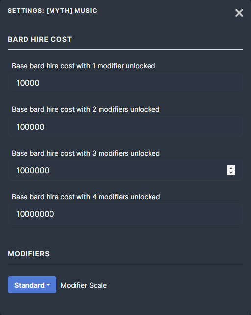

## Standard Scaling Bard Bonuses (can be set in settings, not exclusive to standard gamemode)

The bonuses each bard provides is as follows:

Guitar: Unlocked at skill level 1
* Mastery Level 1: +5% Chance for Bird Nests to drop in Woodcutting
* Mastery Level 40: -10% Firemaking Interval
* Mastery Level 75: +15% Firemaking Mastery XP
* Mastery Level 99: +2 minimum Bird Nest's received from Woodcutting
* Upgrade: Bonfires in Firemaking require no logs to light. Automatically relights Bonfires when depleted

Banjo: Unlocked at skill level 10
* Mastery Level 1: -0.5s Fishing Interval
* Mastery Level 40: -10% Cooking Interval
* Mastery Level 75: -30% Passive Cook Interval
* Mastery Level 99: +10% chance to recieve one random special item from Fishing when catching a special item
* Upgrade: +25% chance to gain 1 cooked version of a fish when Fishing

Snare Drum: Unlocked at skill level 20
* Mastery Level 1: -0.2s Mining Interval
* Mastery Level 40: -0.2s Smithing Interval
* Mastery Level 75: -3 Coal Ore Cost when Smithing
* Mastery Level 99: x4 Ores received from Mining
* Upgrade: x4 Rune Essence received from Mining

Accordion: Unlocked at skill level 30
* Mastery Level 1: +5% Hitpoint Regeneration
* Mastery Level 40: +15% Auto Eat Efficiency
* Mastery Level 75: Target Damage Reduction is decreased by flat 10%
* Mastery Level 99: +5% Auto Eat Threshold
* Upgrade: +5% Chance To Double Loot in Combat

Bouzouki: Unlocked at skill level 40
* Mastery Level 1: +10% Chance to Preserve Resources in Skills
* Mastery Level 40: +10% Global GP (except Item Sales)
* Mastery Level 75: +10% Chance to Double Items Globally
* Mastery Level 99: 10% increased chance to receive Global Rare Items, Mastery Tokens, Bird Nests from Woodcutting, Gems from Mining, and Coal from Firemaking
* Upgrade: +100 GP gained when earning GP, except Alt. Magic and Item Sales

Flute: Unlocked at skill level 45 (AoD only)
* Mastery Level 1: +10% chance to preserve dig site map excavation actions
* Mastery Level 40: -10% Cartography survey interval
* Mastery Level 75: -10% dig site map refinement cost
* Mastery Level 99: +2 minimum Items found in Archaeology
* Upgrade: Gain GP equal to +15 per Archaeology Skill Level per excavation action that locates no Artefacts

Maracas: Unlocked at skill level 50
* Mastery Level 1: +5% Crafting Skill XP
* Mastery Level 40: +5% Fletching Skill XP
* Mastery Level 75: x4 Items received from Fletching
* Mastery Level 99: x4 Items received from Crafting
* Upgrade: +2 base Javelins produced per action in Fletching

Xylophone: Unlocked at skill level 60
* Mastery Level 1: -10% Agility Obstacle Build Costs
* Mastery Level 40: +15% GP From Agility
* Mastery Level 75: -15% Agility Interval
* Mastery Level 99: -10% Agility Pillar build costs
* Upgrade: +25% GP from Agility per active Obstacle

Saxaphone: Unlocked at skill level 70
* Mastery Level 1: +5% Global Evasion
* Mastery Level 40: +10% Lifesteal
* Mastery Level 75: +5% Damage Reduction
* Mastery Level 99: +5% Maximum Hitpoints
* Upgrade: +50 Maximum Hitpoints

Violin: Unlocked at skill level 80
* Mastery Level 1: +10% chance to preserve resources when Runecrafting runes
* Mastery Level 40: Gain +1 Prayer Points for each successful Enemy hit on you
* Mastery Level 75: Create +6 Additional Runes of the same type in Runecrafting
* Mastery Level 99: -3 Prayer Point Cost for Prayers
* Upgrade: +50% Chance to receive random Elemental Runes from Runecrafting when creating Runes

Djembe: Unlocked at skill level 90
* Mastery Level 1: -5% Slayer Task monster Accuracy Rating
* Mastery Level 40: +10% Damage To Slayer Tasks
* Mastery Level 75: +40% Slayer Coins
* Mastery Level 99: +25% Flat Slayer Area Effect Negation
* Upgrade: +20% Slayer Skill XP

French Horn: Unlocked at skill level 100 (TotH only)
* Mastery Level 1: +5% chance to locate a Meteorite in Astrology
* Mastery Level 40: -0.5s Astrology Interval
* Mastery Level 75: -1s Summoning Interval
* Mastery Level 99: +15 Base Quantity for Summoning Tablet Creation
* Upgrade: +35% Summoning Maximum Hit

Harp: Unlocked at skill level 105 (TotH only)
* Mastery Level 1: +10% Chance to receive a Random Tier of the same Potion in Herblore
* Mastery Level 40: +50 Stealth while Thieving
* Mastery Level 75: x4 Items received from Herblore
* Mastery Level 99: +15% chance to receive Thieving Area Unique Item
* Upgrade: +20% Chance to Double Items in Thieving

Tambourine: Unlocked at skill level 110 (TotH only)
* Mastery Level 1: +10% Farming Yield
* Mastery Level 40: +15 harvest quantity from Farming (Cannot be doubled or multiplied)
* Mastery Level 75: +10% Township GP Production
* Mastery Level 99: +50% Township Happiness
* Upgrade: +25% Chance to Double Farming Yield

Trumpet: Unlocked at skill level 115 (TotH only)
* Mastery Level 1: +5% Accuracy Rating
* Mastery Level 40: +5% of Maximum Hit added to Minimum Hit
* Mastery Level 75: +10% Maximum Hit
* Mastery Level 99: -0.5s Attack Interval
* Upgrade: +20% chance to apply Decay Curse to the Target per hit

## Hardcore Scaling Bard Bonuses (can be set in settings, not exclusive to hardcore gamemode)

The bonuses each bard provides is as follows:

Guitar: Unlocked at skill level 1
* Mastery Level 1: +2% Chance for Bird Nests to drop in Woodcutting
* Mastery Level 40: -5% Firemaking Interval
* Mastery Level 75: +5% Firemaking Mastery XP
* Mastery Level 99: +1 minimum Bird Nest's received from Woodcutting
* Upgrade: Bonfires in Firemaking require no logs to light. Automatically relights Bonfires when depleted

Banjo: Unlocked at skill level 10
* Mastery Level 1: -0.2s Fishing Interval
* Mastery Level 40: -5% Cooking Interval
* Mastery Level 75: -10% Passive Cook Interval
* Mastery Level 99: +1% chance to recieve one random special item from Fishing when catching a special item
* Upgrade: +5% chance to gain 1 cooked version of a fish when Fishing

Snare Drum: Unlocked at skill level 20
* Mastery Level 1: -0.1s Mining Interval
* Mastery Level 40: -0.1s Smithing Interval
* Mastery Level 75: -1 Coal Ore Cost when Smithing
* Mastery Level 99: x2 Ores received from Mining
* Upgrade: x2 Rune Essence received from Mining

Accordion: Unlocked at skill level 30
* Mastery Level 1: +2% Hitpoint Regeneration
* Mastery Level 40: +5% Auto Eat Efficiency
* Mastery Level 75: Target Damage Reduction is decreased by flat 2%
* Mastery Level 99: +2% Auto Eat Threshold
* Upgrade: +2% Chance To Double Loot in Combat

Bouzouki: Unlocked at skill level 40
* Mastery Level 1: +5% Chance to Preserve Resources in Skills
* Mastery Level 40: +5% Global GP (except Item Sales)
* Mastery Level 75: +2% Chance to Double Items Globally
* Mastery Level 99: 2% increased chance to receive Global Rare Items, Mastery Tokens, Bird Nests from Woodcutting, Gems from Mining, and Coal from Firemaking
* Upgrade: +25 GP gained when earning GP, except Alt. Magic and Item Sales

Flute: Unlocked at skill level 45 (AoD only)
* Mastery Level 1: +5% chance to preserve dig site map excavation actions
* Mastery Level 40: -5% Cartography survey interval
* Mastery Level 75: -5% dig site map refinement cost
* Mastery Level 99: +1 minimum Items found in Archaeology
* Upgrade: Gain GP equal to +5 per Archaeology Skill Level per excavation action that locates no Artefacts

Maracas: Unlocked at skill level 50
* Mastery Level 1: +5% Crafting Skill XP
* Mastery Level 40: +5% Fletching Skill XP
* Mastery Level 75: x2 Items received from Fletching
* Mastery Level 99: x2 Items received from Crafting
* Upgrade: +1 base Javelins produced per action in Fletching

Xylophone: Unlocked at skill level 60
* Mastery Level 1: -5% Agility Obstacle Build Costs
* Mastery Level 40: +5% GP From Agility
* Mastery Level 75: -5% Agility Interval
* Mastery Level 99: -5% Agility Pillar build costs
* Upgrade: +5% GP from Agility per active Obstacle

Saxaphone: Unlocked at skill level 70
* Mastery Level 1: +2% Global Evasion
* Mastery Level 40: +2% Lifesteal
* Mastery Level 75: +2% Damage Reduction
* Mastery Level 99: +2% Maximum Hitpoints
* Upgrade: +10 Maximum Hitpoints

Violin: Unlocked at skill level 80
* Mastery Level 1: +5% chance to preserve resources when Runecrafting runes
* Mastery Level 40: Gain +1 Prayer Points for each successful Enemy hit on you
* Mastery Level 75: Create +2 Additional Runes of the same type in Runecrafting
* Mastery Level 99: -1 Prayer Point Cost for Prayers
* Upgrade: +5% Chance to receive random Elemental Runes from Runecrafting when creating Runes

Djembe: Unlocked at skill level 90
* Mastery Level 1: -2% Slayer Task monster Accuracy Rating
* Mastery Level 40: +2% Damage To Slayer Tasks
* Mastery Level 75: +5% Slayer Coins
* Mastery Level 99: +5% Flat Slayer Area Effect Negation
* Upgrade: +5% Slayer Skill XP

French Horn: Unlocked at skill level 100 (TotH Only)
* Mastery Level 1: +1% chance to locate a Meteorite in Astrology
* Mastery Level 40: -0.1s Astrology Interval
* Mastery Level 75: -0.25s Summoning Interval
* Mastery Level 99: +3 Base Quantity for Summoning Tablet Creation
* Upgrade: +5% Summoning Maximum Hit

Harp: Unlocked at skill level 105 (TotH Only)
* Mastery Level 1: +2% Chance to receive a Random Tier of the same Potion in Herblore
* Mastery Level 40: +15 Stealth while Thieving
* Mastery Level 75: x2 Items received from Herblore
* Mastery Level 99: +2% chance to receive Thieving Area Unique Item
* Upgrade: +2% Chance to Double Items in Thieving

Tambourine: Unlocked at skill level 110 (TotH Only)
* Mastery Level 1: +5% Farming Yield
* Mastery Level 40: +2 harvest quantity from Farming (Cannot be doubled or multiplied)
* Mastery Level 75: +2% Township GP Production
* Mastery Level 99: +5% Township Happiness
* Upgrade: +5% Chance to Double Farming Yield

Trumpet: Unlocked at skill level 115 (TotH Only)
* Mastery Level 1: +2% Accuracy Rating
* Mastery Level 40: +1% of Maximum Hit added to Minimum Hit
* Mastery Level 75: +2% Maximum Hit
* Mastery Level 99: -0.1s Attack Interval
* Upgrade: +1% chance to apply Decay Curse to the Target per hit

## Attribution

Images obtained from the following sources, attribution provided.

<a href="https://www.freepik.com/free-vector/cute-red-panda-playing-guitar-cartoon-vector-icon-illustration-animal-music-icon-concept-isolated_31966379.htm">Image by catalyststuff on Freepik</a>

<a href="https://www.freepik.com/free-vector/musical-instrument-set_8610228.htm#query=cartoon%20instrument&position=0&from_view=keyword&track=ais">Image by pch.vector on Freepik</a>

<a href="https://www.flaticon.com/free-icons/troubadour">Troubadour icons created by Freepik - Flaticon</a>

<a href="https://www.flaticon.com/free-icons/sheet-music" title="sheet music icons">Sheet music icons created by Freepik - Flaticon</a>

<a href="https://www.flaticon.com/free-icons/ui" title="ui icons">Ui icons created by Dragon Icons - Flaticon</a>

<a href="https://www.flaticon.com/free-icons/gemstone" title="gemstone icons">Gemstone icons created by Kroffle - Flaticon</a>

<a href="https://www.flaticon.com/free-icons/access" title="access icons">Access icons created by Freepik - Flaticon</a>

<a href="https://www.flaticon.com/free-icons/famous" title="famous icons">Famous icons created by Freepik - Flaticon</a>

<a href="https://www.flaticon.com/free-icons/guitar" title="guitar icons">Guitar icons created by Freepik - Flaticon</a>

<a href="https://www.freepik.com/free-vector/aesthetic-jazz-background-musical-instrument-border-blue-vector_20346432.htm#query=musical%20background&position=16&from_view=search&track=ais">Image by rawpixel.com on Freepik</a>

<a href="https://www.flaticon.com/free-icons/music-and-multimedia" title="music and multimedia icons">Music and multimedia icons created by Mihimihi - Flaticon</a>

<a href="https://www.flaticon.com/free-icons/circus-tent" title="circus tent icons">Circus tent icons created by Freepik - Flaticon</a>

<a href="https://www.flaticon.com/free-icons/professions-and-jobs" title="professions and jobs icons">Professions and jobs icons created by Freepik - Flaticon</a>

<a href="https://www.flaticon.com/free-icons/jester" title="jester icons">Jester icons created by Freepik - Flaticon</a>

<a href="https://www.flaticon.com/free-icons/jester" title="jester icons">Jester icons created by Freepik - Flaticon</a>

<a href="https://www.flaticon.com/free-icons/cultures" title="cultures icons">Cultures icons created by Freepik - Flaticon</a>

<a href="https://www.flaticon.com/free-icons/flute" title="flute icons">Flute icons created by Freepik - Flaticon</a>
