# [Myth] Music

Does not contain actual music. Sorry. :(

Disclaimer: Please backup your save file before installing this mod, preferably importing it into a new save slot. That way if anything happens, or you decide to not want this mod anymore, you can easily uninstall the mod, delete the save, and go back to the existing save from before installing this mod.

Please provide any feedback or bug reports, would love to hear your thoughts.

Note: I've checked Android and iOS to maximize people giving this skill a go, however I only have an android phone available and I have NOT tested on mobile, only on Steam and Browser. Let me know if something goes wrong on mobile and I'll try to fix it.

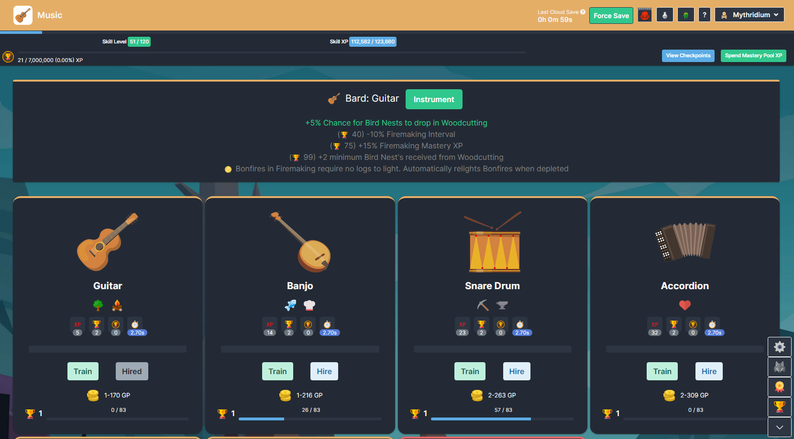

## Design Methodology

When designing this skill, my aims were to take pressure off early game gold, while also providing a late game gold siphon. This makes it an attractive early game skill for adventure mode, and late game, especially once Township is up and running, the buffs are designed to be powerful enough that spending the gold is deemed worth it. By limiting to only a couple of bards, the player will need to spend their masses of gold to get the bonuses for the skills they are training.

## Change Log

### 1.4.0
* reduced tips (GP) scaling from mastery level from +15 GP each level to +10 GP each level, base instrument GP is no longer the same across all instruments, higher level instruments have a higher base GP than lower level instruments. This should hopefully make higher instruments feel a little better, this does result in less GP from lower instruments than the previous version.
* added three more instruments; the accordion, bouzouki and xylophone
* modified some instrument unlock levels and bonuses
  * drum - Unlock Level 15 -> Level 10
  * banjo - Unlock Level 30 -> Level 20
  * saxophone - Unlock Level 45 -> Level 70, now focused on defensive modifiers only
  * maraca - Unlock Level 60 -> Level 50
  * violin - Unlock Level 75 -> Level 80
  * bongo - now focused entirely on slayer, agility has been moved to xylophone
  * french horn - switched level 1 and 40 modifier bonuses
  * tambourine - increased level 1 farming yield % from 5 to 10 and level 40 flat farming yield from 5 to 15
  * trumpet - now focused on damage dealing only
* added a new shop purchase which lets you hire two bards at once
* added a new item, sheet music which is dropped while training Music
* added a new item, essence of music, which is upgraded from sheet music
* added the ability to upgrade hired bard instruments which unlocks a 5th modifier

### 1.3.0
* added a potion to Herblore which increases GP obtained while training Music
* added a summoning tablet for the Music skill, the Bard
* added a Music Scroll of XP which can be purchased from the Township trader with Planks
* added a Music Outfit to the Township category of the shop, it functions the same all other skilling outfits

### 1.2.0

* updated description of mastery and mastery pool hire cost reduction to better align with skill capes (no functional change)
* updated exponential calculation to clamp mastery between level 1 and 99 instead of throwing an error if outside this range
* adjusted the level that instruments are available at
* adjusted the experience gained from training. The time it takes to level should be roughly equivalent to Astrology, assuming no interval increases, xp modifiers, etc and you train the highest level instrument available
* added 3 new instruments; the harp, tambourine and maraca

### 1.1.0

* fixed hire dialog allowing to hire without enough gold
* updated instrument icons

### 1.0.3

* fixed violin 99 mastery bonus to reduce prayer cost instead of increase it

### 1.0.2

* fixed music mastery token granting no experience

### 1.0.1

* fixed the spelling of saxophone
* removed mastery token, capes and pet from being required for completion log
* removed music from being required for max and superior max capes
* skill cape now also reduces bard hire cost by 5% and increased gold earned from music by 5%
* superior skill cape now also reduces bard hire cost by 10% and increased gold earned from music by 10%

### 1.0.0

* initial release

## Training

Music is a brand new skill which combines themes from Astrology, Thieving and Agility. It provides an easy way to obtain gold and powerful bonuses that benefit other skills.

Earn tips (GP) while you train bards with various instruments, then hire the bards you have trained to provide you with powerful bonuses while you train other skills.

This mod includes a new mastery token for the skill and both skill cape and superior skill cape.

### Drops

While training you have a chance to obtain Signet Ring Half A, Circlet of Rhaelyx and Mysterious Stones, just like any other non combat skill.

Tips (GP) earned while training do scale with global gold increases.

### Sheet Music and Essence of Music

Training Music has a 1/100 chance to drop sheet music, these can be upgraded into Essence of Music for 50 Sheet Music + 1M GP.

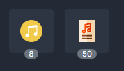

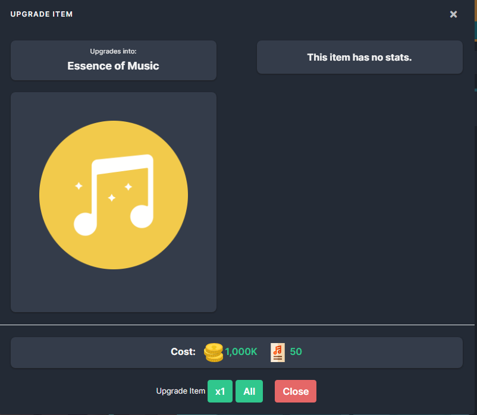

1 Essence of Music is used to upgrade Hired Bard instruments, which unlocks a 5th modifier.

Upgrades are destroyed if you hire a new bard. Re-hiring a previously hired bard will require using another Essence of Music to unlock the upgrade modifier.

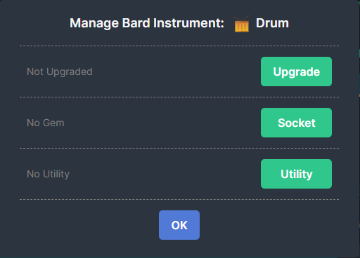

## Hiring a Bard

You can hire various bards to play on your behalf. These bards provide powerful bonuses to help you while you train other skills, however the more skilled a bard is, the more expensive it will become to hire them.

You can only hire a single bard at a time (two if you purchase the Band Practice upgrade).

The cost of hiring a bard grows exponentially more expensive per mastery level.

## Band Practice

The shop sells an upgrade which unlocks a second bard slot. This upgrade requires Level 110 Music and costs 1B GP.

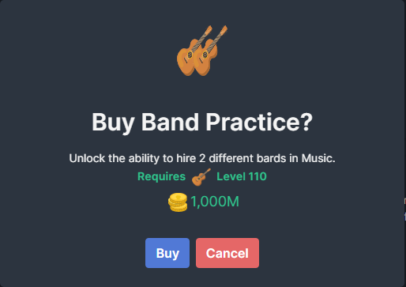

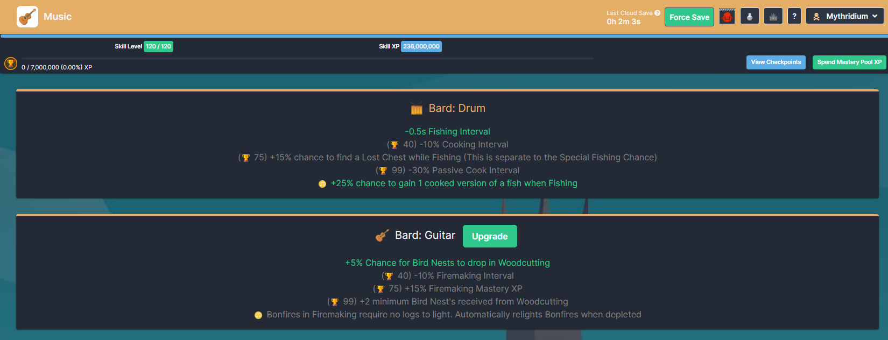

## Skill Unlocks

Leveling the Music skill unlocks additional musical instruments to train your bards with.

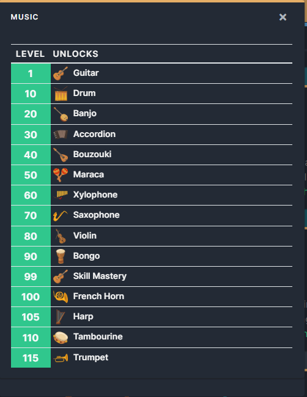

## Mastery Pool Unlocks

Mastery Pool checkpoints provide additional xp, mastery xp, music interval and hire cost reduction.

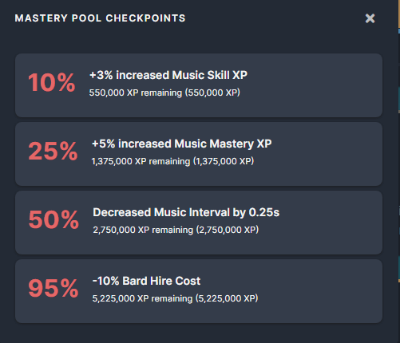

## Mastery Unlocks

As you level up an instruments mastery, the tips you earn increases, but the cost to hire the bard for that instrument also increases. You also unlock additional bonuses and reduce the hire cost.

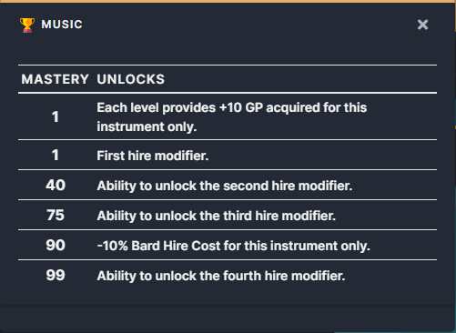

## Skill Capes

The Music Skill Cape

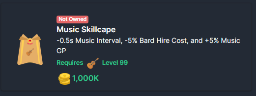

The Superior Music Skill Cape

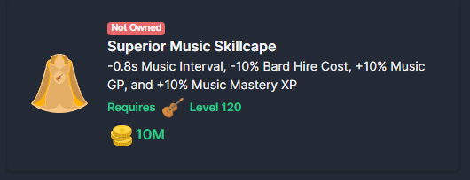

## Pet

The Music skill also contains a pet: Muse which provides -1% Music Interval

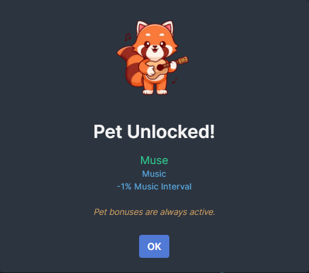

## Herblore

The Generous Gratuity Potion can be brewed using the Herblore skill.

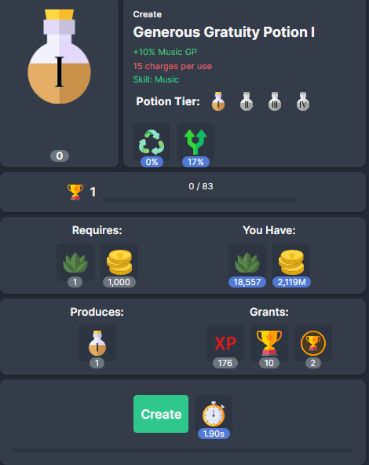

* Herblore Unlock Level: 80
* Materials: 1 Pigtayle Herb + 1,000 GP
* Tier 1: +10% Music GP, 15 Charges
* Tier 2: +20% Music GP, 25 Charges
* Tier 3: +30% Music GP, 35 Charges
* Tier 4: +50% Music GP, 50 Charges

The potion has also been added to Potion Box II from Township, at the same rarity as the Herblore Potion.

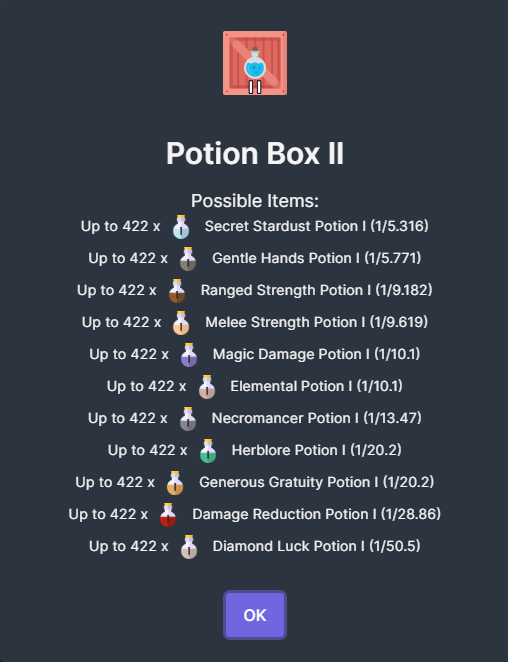

## Summoning

The Music skill has its own tablet. The Bard! The Bard is both a combat and skill tablet.

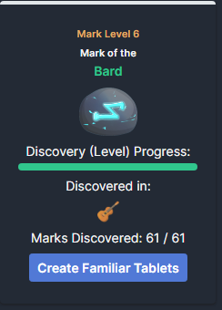

* Tier: 3
* Summoning Level Requirement: 90
* Summoning Max Hit: 192
* Skill Bonus: +5% Music GP

In addition, the Bard has synergies with every single other tablet. Since Music is a skill that focuses on boosting other skills, its synergy helps all other skills. It basically doubles the tablet effect of the tablet it is synergizing with (by granting the same tablet modifiers via the synergy).

Example: Devil gives -5% Firemaking Interval, if synergized with the Bard, the synergy will provide an addition -5% Firemaking Interval for a total of -10% Firemaking Interval being provided from the tablets.

The Fox synergy actually works in reverse, kind of... the Bard synergy doubles the Fox tablet modifier, which then boosts the Bards Summoning max hit.

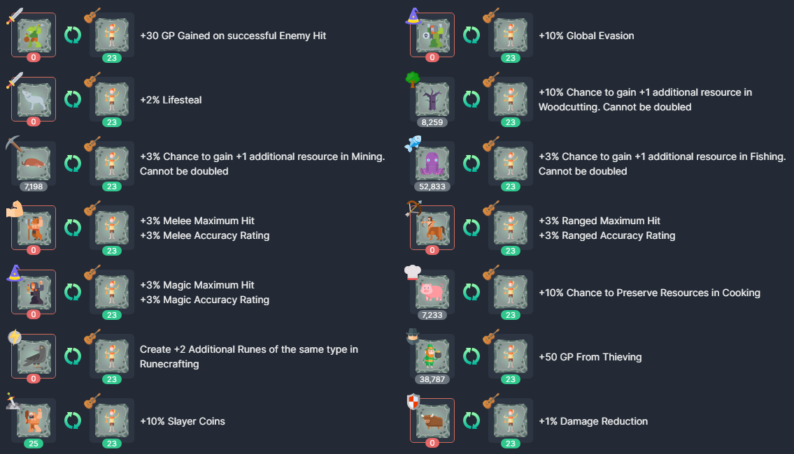

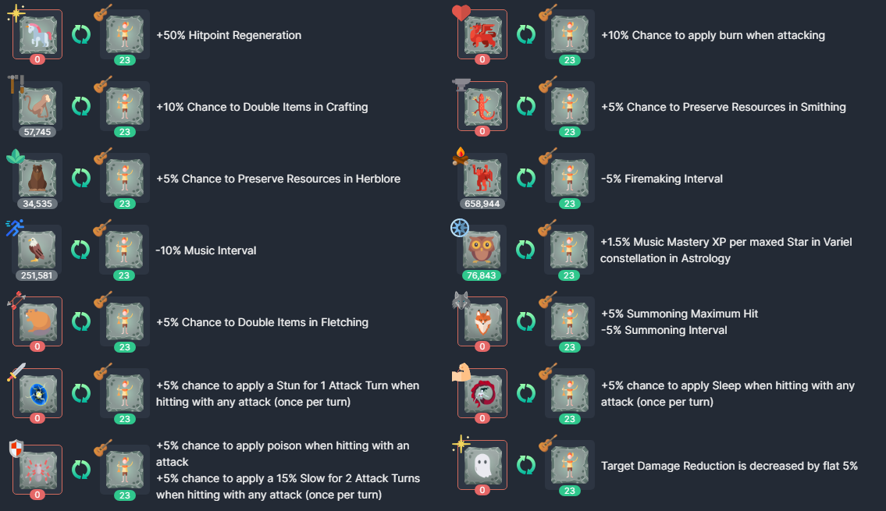

## Township

The Music skill adds a Music Scroll of XP granting +3% Music Skill XP. It functions the same as other scrolls of xp.

It requires level 15 Township and level 15 Music to purchase, with a default value of 80 planks per scroll.

The Music skill adds a Music Outfit, which is fully integrated just like all the other skilling outfits.

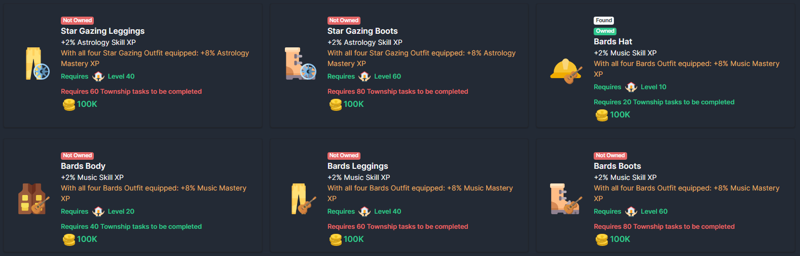

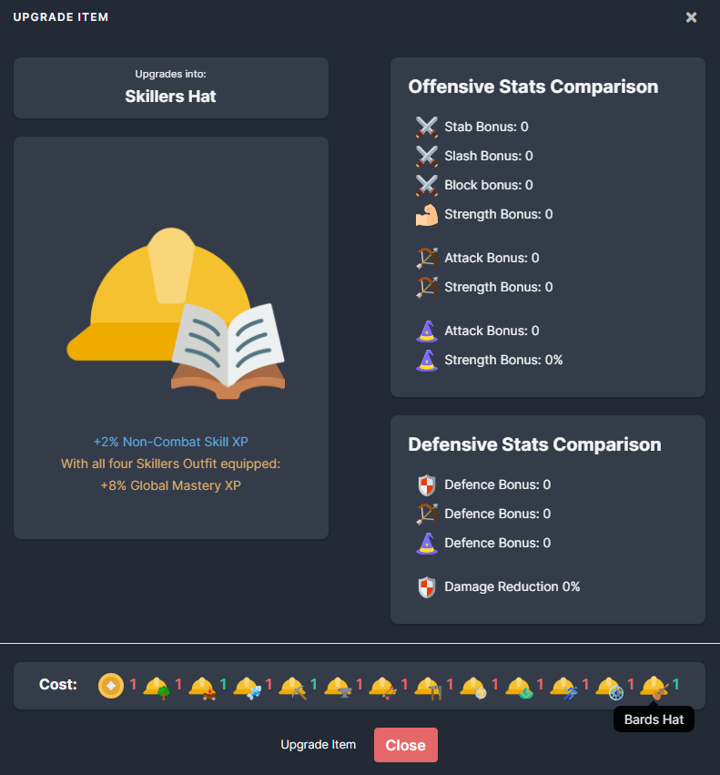

### Bard Bonuses

The bonuses each bard provides is as follows:

Guitar: Unlocked at skill level 1
* Mastery Level 1: +5% Chance for Bird Nests to drop in Woodcutting
* Mastery Level 40: -10% Firemaking Interval
* Mastery Level 75: +15% Firemaking Mastery XP
* Mastery Level 99: +2 minimum Bird Nest's received from Woodcutting
* Upgrade: Bonfires in Firemaking require no logs to light. Automatically relights Bonfires when depleted

Drum: Unlocked at skill level 10
* Mastery Level 1: -0.5s Fishing Interval
* Mastery Level 40: -10% Cooking Interval
* Mastery Level 75: +15% chance to find a Lost Chest while Fishing (This is separate to the Special Fishing Chance)
* Mastery Level 99: -30% Passive Cook Interval
* Upgrade: +25% chance to gain 1 cooked version of a fish when Fishing

Banjo: Unlocked at skill level 20
* Mastery Level 1: -0.2s Mining Interval
* Mastery Level 40: -0.2s Smithing Interval
* Mastery Level 75: -3 Coal Ore Cost when Smithing
* Mastery Level 99: x4 Ores received from Mining
* Upgrade: x4 Rune Essence received from Mining

Accordion: Unlocked at skill level 30
* Mastery Level 1: +5% Hitpoint Regeneration
* Mastery Level 40: +15% Auto Eat Efficiency
* Mastery Level 75: +10% Chance To Double Loot in Combat
* Mastery Level 99: Target Damage Reduction is decreased by flat 10%
* Upgrade: +10% Auto Eat Threshold

Bouzouki: Unlocked at skill level 40
* Mastery Level 1: +10% Chance to Preserve Resources in Skills
* Mastery Level 40: +10% Global GP (except Item Sales)
* Mastery Level 75: +15% Chance to Double Items Globally
* Mastery Level 99: 10% increased chance to receive Global Rare Items, Mastery Tokens, Bird Nests from Woodcutting, Gems from Mining, and Coal from Firemaking
* Upgrade: +15% GP From Sales

Maraca: Unlocked at skill level 50
* Mastery Level 1: +5% Crafting Skill XP
* Mastery Level 40: +5% Fletching Skill XP
* Mastery Level 75: x4 Items received from Fletching
* Mastery Level 99: x4 Items received from Crafting
* Upgrade: +2 base Javelins produced per action in Fletching

Xylophone: Unlocked at skill level 60
* Mastery Level 1: -10% Agility Obstacle Build Costs
* Mastery Level 40: +15% GP From Agility
* Mastery Level 75: -15% Agility Interval
* Mastery Level 99: -10% Agility Pillar build costs
* Upgrade: +25% GP from Agility per active Obstacle

Saxaphone: Unlocked at skill level 70
* Mastery Level 1: +5% Global Evasion
* Mastery Level 40: +10% Lifesteal
* Mastery Level 75: +100 Maximum Hitpoints
* Mastery Level 99: +10% Damage Reduction
* Upgrade: +5% Maximum Hitpoints

Violin: Unlocked at skill level 80
* Mastery Level 1: +10% chance to preserve resources when Runecrafting runes
* Mastery Level 40: Gain +1 Prayer Points for each successful Enemy hit on you
* Mastery Level 75: Create +6 Additional Runes of the same type in Runecrafting
* Mastery Level 99: -3 Prayer Point Cost for Prayers
* Upgrade: +50% Chance to receive random Elemental Runes from Runecrafting when creating Runes

Bongo: Unlocked at skill level 90
* Mastery Level 1: -5% Slayer Task monster Accuracy Rating
* Mastery Level 40: +10% Damage To Slayer Tasks
* Mastery Level 75: +40% Slayer Coins
* Mastery Level 99: +25% Flat Slayer Area Effect Negation
* Upgrade: +20% Slayer Skill XP

French Horn: Unlocked at skill level 100
* Mastery Level 1: +5% chance to locate a Meteorite in Astrology
* Mastery Level 40: -0.5s Astrology Interval
* Mastery Level 75: -1s Summoning Interval
* Mastery Level 99: +15 Base Quantity for Summoning Tablet Creation
* Upgrade: +35% Summoning Maximum Hit

Harp: Unlocked at skill level 105
* Mastery Level 1: +10% Chance to receive a Random Tier of the same Potion in Herblore
* Mastery Level 40: +50 Stealth while Thieving
* Mastery Level 75: x4 Items received from Herblore
* Mastery Level 99: +15% chance to receive Thieving Area Unique Item
* Upgrade: +20% Chance to Double Items in Thieving

Tambourine: Unlocked at skill level 110
* Mastery Level 1: +10% Farming Yield
* Mastery Level 40: +15 harvest quantity from Farming (Cannot be doubled or multiplied)
* Mastery Level 75: +10% Township GP Production
* Mastery Level 99: +50% Township Happiness
* Upgrade: +25% Chance to Double Farming Yield

Trumpet: Unlocked at skill level 115
* Mastery Level 1: +5% Accuracy Rating
* Mastery Level 40: +5% of Maximum Hit added to Minimum Hit
* Mastery Level 75: +10% Maximum Hit
* Mastery Level 99: -0.5s Attack Interval
* Upgrade: +20% chance to apply Decay Curse to the Target per hit

### Cost to Hire a Bard

The cost for hiring a bard is as follows: (Starts at 10,000 GP and maxes out at 200M GP)

* Mastery Level: 1 - GP Cost:10000
* Mastery Level: 2 - GP Cost:11000
* Mastery Level: 3 - GP Cost:12000
* Mastery Level: 4 - GP Cost:14000
* Mastery Level: 5 - GP Cost:15000
* Mastery Level: 6 - GP Cost:17000
* Mastery Level: 7 - GP Cost:18000
* Mastery Level: 8 - GP Cost:20000
* Mastery Level: 9 - GP Cost:22000
* Mastery Level: 10 - GP Cost: 25000
* Mastery Level: 11 - GP Cost: 27000
* Mastery Level: 12 - GP Cost: 30000
* Mastery Level: 13 - GP Cost: 34000
* Mastery Level: 14 - GP Cost: 37000
* Mastery Level: 15 - GP Cost: 41000
* Mastery Level: 16 - GP Cost: 46000
* Mastery Level: 17 - GP Cost: 50000
* Mastery Level: 18 - GP Cost: 56000
* Mastery Level: 19 - GP Cost: 62000
* Mastery Level: 20 - GP Cost: 68000
* Mastery Level: 21 - GP Cost: 75000
* Mastery Level: 22 - GP Cost: 83000
* Mastery Level: 23 - GP Cost: 92000
* Mastery Level: 24 - GP Cost: 102000
* Mastery Level: 25 - GP Cost: 113000
* Mastery Level: 26 - GP Cost: 125000
* Mastery Level: 27 - GP Cost: 138000
* Mastery Level: 28 - GP Cost: 153000
* Mastery Level: 29 - GP Cost: 169000
* Mastery Level: 30 - GP Cost: 187000
* Mastery Level: 31 - GP Cost: 207000
* Mastery Level: 32 - GP Cost: 229000
* Mastery Level: 33 - GP Cost: 254000
* Mastery Level: 34 - GP Cost: 281000
* Mastery Level: 35 - GP Cost: 311000
* Mastery Level: 36 - GP Cost: 344000
* Mastery Level: 37 - GP Cost: 380000
* Mastery Level: 38 - GP Cost: 421000
* Mastery Level: 39 - GP Cost: 465000
* Mastery Level: 40 - GP Cost: 515000
* Mastery Level: 41 - GP Cost: 570000
* Mastery Level: 42 - GP Cost: 630000
* Mastery Level: 43 - GP Cost: 697000
* Mastery Level: 44 - GP Cost: 771000
* Mastery Level: 45 - GP Cost: 853000
* Mastery Level: 46 - GP Cost: 944000
* Mastery Level: 47 - GP Cost: 1044000
* Mastery Level: 48 - GP Cost: 1155000
* Mastery Level: 49 - GP Cost: 1278000
* Mastery Level: 50 - GP Cost: 1414000
* Mastery Level: 51 - GP Cost: 1565000
* Mastery Level: 52 - GP Cost: 1731000
* Mastery Level: 53 - GP Cost: 1915000
* Mastery Level: 54 - GP Cost: 2119000
* Mastery Level: 55 - GP Cost: 2344000
* Mastery Level: 56 - GP Cost: 2593000
* Mastery Level: 57 - GP Cost: 2869000
* Mastery Level: 58 - GP Cost: 3174000
* Mastery Level: 59 - GP Cost: 3512000
* Mastery Level: 60 - GP Cost: 3885000
* Mastery Level: 61 - GP Cost: 4298000
* Mastery Level: 62 - GP Cost: 4755000
* Mastery Level: 63 - GP Cost: 5261000
* Mastery Level: 64 - GP Cost: 5820000
* Mastery Level: 65 - GP Cost: 6439000
* Mastery Level: 66 - GP Cost: 7124000
* Mastery Level: 67 - GP Cost: 7882000
* Mastery Level: 68 - GP Cost: 8720000
* Mastery Level: 69 - GP Cost: 9647000
* Mastery Level: 70 - GP Cost: 10673000
* Mastery Level: 71 - GP Cost: 11808000
* Mastery Level: 72 - GP Cost: 13063000
* Mastery Level: 73 - GP Cost: 14452000
* Mastery Level: 74 - GP Cost: 15989000
* Mastery Level: 75 - GP Cost: 17690000
* Mastery Level: 76 - GP Cost: 19571000
* Mastery Level: 77 - GP Cost: 21652000
* Mastery Level: 78 - GP Cost: 23954000
* Mastery Level: 79 - GP Cost: 26501000
* Mastery Level: 80 - GP Cost: 29320000
* Mastery Level: 81 - GP Cost: 32437000
* Mastery Level: 82 - GP Cost: 35887000
* Mastery Level: 83 - GP Cost: 39703000
* Mastery Level: 84 - GP Cost: 43925000
* Mastery Level: 85 - GP Cost: 48596000
* Mastery Level: 86 - GP Cost: 53763000
* Mastery Level: 87 - GP Cost: 59480000
* Mastery Level: 88 - GP Cost: 65805000
* Mastery Level: 89 - GP Cost: 72803000
* Mastery Level: 90 - GP Cost: 80545000
* Mastery Level: 91 - GP Cost: 89110000
* Mastery Level: 92 - GP Cost: 98586000
* Mastery Level: 93 - GP Cost: 109069000
* Mastery Level: 94 - GP Cost: 120667000
* Mastery Level: 95 - GP Cost: 133499000
* Mastery Level: 96 - GP Cost: 147695000
* Mastery Level: 97 - GP Cost: 163401000
* Mastery Level: 98 - GP Cost: 180776000
* Mastery Level: 99 - GP Cost: 200000000

## Attribution

Images obtained from the following sources, attribution provided.

<a href="https://www.freepik.com/free-vector/cute-red-panda-playing-guitar-cartoon-vector-icon-illustration-animal-music-icon-concept-isolated_31966379.htm">Image by catalyststuff on Freepik</a>

<a href="https://www.freepik.com/free-vector/musical-instrument-set_8610228.htm#query=cartoon%20instrument&position=0&from_view=keyword&track=ais">Image by pch.vector on Freepik</a>

<a href="https://www.flaticon.com/free-icons/troubadour">Troubadour icons created by Freepik - Flaticon</a>

<a href="https://www.flaticon.com/free-icons/sheet-music" title="sheet music icons">Sheet music icons created by Freepik - Flaticon</a>

<a href="https://www.flaticon.com/free-icons/ui" title="ui icons">Ui icons created by Dragon Icons - Flaticon</a>
